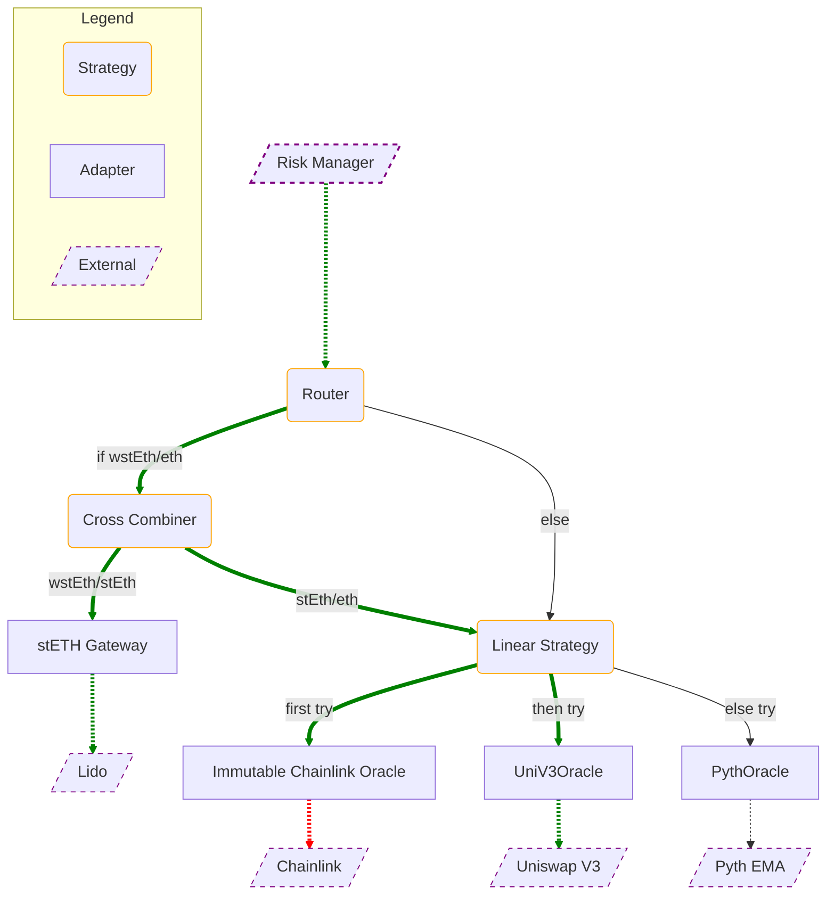

# Euler Oracles

## Table of Contents
<!-- TOC FOLLOWS -->
<!-- START OF TOC -->
<!-- md-toc: https://github.com/hoytech/md-toc -->

* [Table of Contents](#table-of-contents)
* [Introduction](#introduction)
* [Interface](#interface)
* [Specification](#specification)
    * [Definitions](#definitions)
    * [Methods](#methods)
        * [`description`](#`description`)
        * [`Description` schema](#`description`-schema)
        * [`getQuote` and `getQuotes`](#`getquote`-and-`getquotes`)
        * [`getQuote`](#`getquote`)
        * [`getQuotes`](#`getquotes`)
    * [Denominations](#denominations)
* [Data structures](#data-structures)
    * [Immutable Address Array](#immutable-address-array)
    * [Packed Uint32 Array](#packed-uint32-array)
* [Adapters](#adapters)
    * [Chainlink](#chainlink)
    * [Chronicle](#chronicle)
    * [Compound V2](#compound-v2)
    * [Constant](#constant)
    * [Curve](#curve)
    * [Lido](#lido)
    * [Pyth](#pyth)
    * [RocketPool](#rocketpool)
    * [Tellor](#tellor)
    * [Uniswap V3](#uniswap-v3)
    * [Yearn V2](#yearn-v2)
* [Strategies](#strategies)
    * [Aggregators](#aggregators)
        * [Supported Aggregator Algorithms](#supported-aggregator-algorithms)
        * [Custom Aggregator Algorithms](#custom-aggregator-algorithms)
    * [Linear](#linear)
        * [Supported Linear Algorithms](#supported-linear-algorithms)
    * [Routers](#routers)
        * [Supported Router Algorithms](#supported-router-algorithms)

<!-- END OF TOC -->

## Introduction

## Interface
Euler Oracles conform to the shared `IEOracle` interface.
```solidity
error EOracle_NoAnswer();
error EOracle_NotSupported(address base, address quote);
error EOracle_Overflow();
error EOracle_TooStale(uint256 staleness, uint256 maxStaleness);

function description() external view returns (OracleDescription.Description memory description);
function getQuote(uint256 inAmount, address base, address quote) external view returns (uint256 outAmount);
function getQuotes(uint256 inAmount, address base, address quote) external view returns (uint256 bidOutAmount, uint256 askOutAmount);
```

## Specification
The key words "MUST", "MUST NOT", "REQUIRED", "SHALL", "SHALL NOT", "SHOULD", "SHOULD NOT", "RECOMMENDED",  "MAY", and "OPTIONAL" in this document are to be interpreted as described in [RFC 2119](https://datatracker.ietf.org/doc/html/rfc2119).
### Definitions
- **Asset:** An ERC20 token (denoted by its contract address), a currency (denoted by its ISO 4217 numeric code) or the native coin (denoted by `0xEeee...EEeE`).
- **Base:** The asset which is being priced. This is the numerator of the base/quote pair.
- **Quote:** The asset which is used as the unit of account. This is the denominator of the base/quote pair.
- **EOracle:** Smart contracts that implement the `IEOracle` interface. EOracles can be composed together as part of the Euler Oracles system.
EOracles do not necessarily interface with external providers. They may be used as utility layers for routing, aggregation, or shared governance.
- **Adapter:** An EOracle that directly connects to external contracts or systems that provide pricing. An adapter validates the data and processes it
to conform to the `IEOracle` interface. An adapter may connect to canonical oracle systems like Chainlink or query external DeFi contracts for exchange rates 
(Uniswap V3, wstETH contract). An exception to the rule is the `ConstantOracle` which returns a hard-coded exchange rate but is still regarded as an adapter for consistency.
- **Strategy:** An EOracle that serves as an intermediary logic layer. Strategies forward calls to one or many child EOracles. An example strategy is a router for base/quote pairs or a median aggregator of multiple adapters.
- **Resolution tree:** A tree data structure with EOracles as nodes. The resolution tree defines the complete oracle configuration for a given EVault. 
External calls will always enter via the root of the tree and resolve via a subtree that contains the root.
Leaves of the resolution tree are adapters. Internal nodes are strategies. The tree branches out when it contains a strategy that connects to multiple child EOracles. Strategies aggregate the answers of their immediate children into a single value, which is propagated up the ancestry chain to the root. The resolution tree only defines the topology of the oracle configuration. The path taken by a specific call may depend on the logic inside strategies.

### Methods
Oracles MUST implement `description`, `getQuote` and `getQuotes` as defined by the `IPriceOracle` interface. The methods MUST behave as specified in this section.

#### `description`
```solidity
function description() external view returns (Description memory);
```
- MUST NOT revert. 
- MUST faithfully represent the properties and configuration of the EOracle. 
- MUST reflect changes to the EOracle's properties as a result of governance or other mechanisms.

#### `Description` schema
```solidity
enum Variant {ADAPTER, STRATEGY}
enum Authority {GOVERNED, FINALIZED}
enum Upgradeability {UPGRADEABLE, IMMUTABLE}
enum Algorithm {SPOT, MEDIAN, ... , OTHER}
enum PaymentModel {FREE, SUBSCRIPTION, PER_REQUEST, OTHER}
enum RequestModel {PUSH, PULL, SIGNATURE, INTERNAL, OTHER}

struct Configuration {
    uint256 maxStaleness;
    address governor;
    bool supportsBidAskSpread;
}

struct Description {
    Algorithm algorithm;
    Authority authority;
    PaymentModel paymentModel;
    RequestModel requestModel;
    Variant variant;
    Configuration configuration;
    string name;
}
```
> Some definitions are redacted for brevity. See [src/lib/OracleDescription.sol](src/lib/OracleDescription.sol) for all definitions.
- `variant` MUST NOT change throughout the lifecycle of the EOracle.
- `authority` MUST reflect the current governance state of the EOracle as defined in the [Euler Vaults whitepaper.](https://github.com/euler-xyz/euler-vaults-docs/blob/master/whitepaper.md#governed-vs-finalised)
- `upgradeability` MUST reflect the deployment configuration in the EOracleFactory as defined in the [Euler Vaults whitepaper.](https://github.com/euler-xyz/euler-vaults-docs/blob/master/whitepaper.md#upgradeable-vs-immutable)
- `algorithm` MUST be the pricing algorithm implemented by the connected external oracle if the EOracle is an adapter.
- `algorithm` MUST be the aggregation algorithm internally implemented by the strategy if the EOracle is a strategy.
- `paymentModel` MUST reflect either the external oracle's payment model if the EOracle is an adapter.
- `paymentModel` MUST reflect the strategy's payment model if the EOracle is a strategy.
- `requestModel` MUST be 
    - `PUSH` if price updates are periodically updated on-chain without caller intent.
    - `PULL` if the caller has to make a transaction to request an up-to-date price to be pushed on-chain at a later block.
    - `SIGNATURE` if the price is ingested as part of data that is signed off-chain by a trusted party and verified at the point of execution.
    - `INTERNAL` if the EOracle is a strategy or an adapter whose pricing logic is fully internalized.
- `Configuration.maxStaleness` MUST be the maximum age in seconds of the price accepted by the EOracle. A value of 0 means that the price is updated every block.
- `Configuration.governor` MUST be `address(0)` if `authority` is `FINALIZED` or else the governor address as defined in the [Euler Vaults whitepaper.](https://github.com/euler-xyz/euler-vaults-docs/blob/master/whitepaper.md#governed-vs-finalised)
- `Configuration.supportsBidAskSpread` MUST be `true` if the EOracle natively supports quotes with bid-ask spreads. If this is `false`, then `getQuotes(in,b,q)` MUST return `(getQuote(in,b,q), getQuote(in,b,q))`.
- An EOracle MAY use the enum member `OTHER` whenever none of the other members accurately describe its properties.
- `name` MUST NOT change throughout the lifecycle of the EOracle.
- `name` SHOULD be a short string that describes the EOracle. EOracles are free to choose the format.
- `name` is RECOMMENDED to include the common name of the external system that is queried by adapters (e.g. "Chainlink").

#### `getQuote` and `getQuotes`
- MUST NOT return 0. If `outAmount` is calculated to be 0, then EOracle MUST revert with `PriceOracle_InvalidAnswer`.
- MUST support values for `inAmount` in the range [1, 2\*\*128-1]. Values above this range SHOULD be supported whenever possible.
- MUST revert with the custom error `EOracle_NotSupported` if the EOracle does not support the given base/quote pair either due to a limitation in the external system or due to missing configuration inside the EOracle. Note that the set of supported base/quote pairs could change throughout the lifecycle of the EOracle.
- MUST revert with the custom error `PriceOracle_TooStale` if the external system reports a price that is too old to be trusted.
- If the external call reverts or reports an invalid answer then EOracle MAY revert with the custom error `PriceOracle_NoAnswer` or alternatively bubble up the vendor-specific error.
- SHOULD revert with the custom error `EOracle_ArithmeticError` whenever a mathematical expression internal to the EOracle would overflow, underflow, or is undefined. EOracles SHOULD anticipate overflows wherever possible instead of relying on the run-time exceptions generated by Solidity.

#### `getQuote`
- MUST return the amount of `quote` that is price-equivalent to `inAmount` of `base` without accounting for spread due to slippage, fees or other on-chain conditions.

#### `getQuotes`
- MUST return the bid amount and ask amount of `quote` that is price-equivalent to `inAmount` of `base` by accounting for spread due to slippage, fees or other on-chain conditions.
- MAY return a zero-spread price if the external system does not support spread quotes i.e. return `(getQuote(in,b,q), getQuote(in,b,q))`

### Denominations
Code: [src/lib/Denominations.sol](src/lib/Denominations.sol)

Every asset in Euler Oracles is represented by a 160-bit `address`. To avoid ambiguity, EOracles:
- MUST denote an ERC20 token by its contract address on the host blockchain.
- MUST denote the native coin on the host blockchain by `0xEeeeeEeeeEeEeeEeEeEeeEEEeeeeEeeeeeeeEEeE` IFF the native coin does not implement ERC20.
- MUST denote the native coin on the host blockchain by its contract address IFF the native coin implements ERC20.
- MUST denote a national currency or precious metal by its numeric code as defined by ISO 4217, type-cast to `address`.
- MUST carefully adapt the nomenculature of external systems to the one defined by Euler Oracles.
- SHOULD avoid supporting coins or tokens on external blockchains and instead denominate in their wrapped or bridged versions on the host blockchain.
- MAY treat the native coin and the canonical wrapped asset as interchangeable assets after verifying that the wrapper contract is not mutable, governeable or upgradeable, and supports a 1:1 peg with the native coin, similar to WETH9.
- MAY use the ISO 4217 "No currency" code (999) to denote unknown or non-ISO 4217 currencies. Operations involving such assets MUST revert.
- MAY implement an extension to this standard by providing an alternative unambiguous, domain-separated, and observable standard of denomination.

## Data structures
`ImmutableAddressArray` and `PackedUint32Array` are custom data structures useful for creating gas-efficient strategy EOracles. 

### Immutable Address Array
Code: [src/lib/ImmutableAddressArray.sol](src/lib/ImmutableAddressArray.sol)

An abstract contract that implements a fixed-size read-only array of up to 8 addresses.

The array is stored inside the code of the contract, thus making element retrieval signifcantly cheaper (using `CODECOPY` instead of `SLOAD`). Compared to a storage array, the immutable address array will inflate the gas cost at deployment but will noticeably reduce usage cost. 

The array is constructed by passing an in-memory address array which then intializes the 8 private immutable adresseses. At construction the cardinality (size) of the array is recorded and later used to perform bounds checking.

It internally exposes `get(index) -> element` and `find(element) -> index` methods. 

The immutable address array is practically useful for immutable EOracle strategies. See [src/strategy/linear/LinearStrategy.sol](src/strategy/linear/LinearStrategy.sol) for an example of how it can be used.

### Packed Uint32 Array
Code: [src/lib/PackedUint32Array.sol](src/lib/PackedUint32Array.sol)

A [user defined value type](https://soliditylang.org/blog/2021/09/27/user-defined-value-types/) that packs an ordered array of 8 `uint32` values inside a single 256-bit integer. 

By packing them together, all 8 values can be retrieved from storage with a single `SLOAD`. The internal methods of `PackedUint32Array` implement encoding and decoding that is cheaper than Solidity's native abi decoding. 

The type supports the functions `get`, `set`, `clear`, `mask`, `sum`, `eq`, `neq` which are tailored for its use cases inside EOracle strategies.

`PackedUint32Array` has synergy with `ImmutableAddressArray` as both define an array of size 8.

See [src/strategy/linear/ConstantBackoffLinearStrategy.sol](src/strategy/linear/ConstantBackoffLinearStrategy.sol) where it is used for storing cooldown timestamps.

See the [weighed mean algorithm](src/strategy/aggregator/AggregatorAlgorithms.sol#L75) where it is used as a bitmask over the immutable address array.

## Adapters
TODO

Adapters connect to external oracles and adapt their interfaces and answers to the `IPriceOracle` interface.

### Chainlink
Queries a Chainlink oracle.

### Chronicle
Queries a Chronicle oracle.

### Compound V2
Queries a Compound V2 market to price a cToken in terms of its underlying.

### Constant
Returns a fixed exchange rate between two assets.

### Curve
Queries a Curve pool contract to price an LP token in terms of its underlying tokens.

### Lido
Queries the wstEth contract to convert between stEth and wstEth.

### Pyth
Queries a Pyth oracle. Supports bid-ask spread.

### RocketPool
Queries the Reth contract to convert between Reth and Eth.

### Tellor
Queries a Tellor oracle.

### Uniswap V3
Calculates the TWAP price maintained by a Uniswap V3 pool.

### Yearn V2
Queries a Yearn V2 vault contract to price a yvToken in terms of its underlying.

## Strategies
Euler Oracles support a library of common strategies.

### Aggregators
Aggregator strategies simultaneously query up to 8 underlying oracles and apply a statistical algorithm on the set of results. They also have a notion of `quorum`. Underlying oracles are queried with a `try-catch` mechanism and 

#### Supported Aggregator Algorithms
- `Min` returns the smallest quote of its underlying oracles.
- `Max` returns the largest quote of its underlying oracles.
- `Mean` returns the arithmentic mean quote of its underlying oracles.
- `Median` returns the statistical median quote of its underlying oracles. Note that if the cardinality of the set of answers received is even, then the median is the arithmetic mean of its middle 2 elements.
- `Weighted` returns the weighted arithmetic mean of the set of quotes. Weights are assigned at construction and immutable. If an underlying oracle does not produce a quote then its weight is dropped from the calculation.

#### Custom Aggregator Algorithms
To implement a custom algorithm extend the base `Aggregator` contract and override the virtual `_aggregateQuotes` function.
```solidity
function _aggregateQuotes(
    uint256[] memory quotes, 
    PackedUint32Array mask
) internal view returns (uint256) {
    /// custom aggregation logic
}
```

`quotes` is a compressed array of all valid quotes. `mask` is a bitmask-like data structure that indicates which of the underlying oracles returned successfully.

### Linear
Linear strategies maintain an ordered set of underlying oracles. Underlying oracles are queried in the given order until a valid quote is obtained.

#### Supported Linear Algorithms
- `LinearStrategy` implements the base logic outlined above.
- `ConstantBackoffLinearStrategy` extends the base algorithm and applies a constant-time backoff to unsuccessful queries. When an underlying oracle fails, it will be skipped for the next time period (e.g. 1 hour).

### Routers
Router strategies implement traffic control algorithms. Routers are most useful as top-level entry points for the underlying oracle resolution tree.

#### Supported Router Algorithms
- `SimpleRouter` supports an on-chain mapping of `(base,quote) -> oracle`.
- `FallbackRouter` extends `SimpleRouter` with a fallback oracle that is queried for all unresolved paths.

## Composing EOracles

### Example Configuration


**Explanation:**

In the Risk Manager, the oracle address is configured as `Router`. This is also the root node of the configuration tree.
The Risk Manager calls `Router` to price `wstEth/eth`. The call is routed to the `Cross Combiner` which multiplies the `wstEth/stEth` exchange rate from the Lido contract and the `stEth/eth` price returned by the `Linear Strategy`. The `Linear Strategy` first tries to fetch `wstEth/eth` from Chainlink but fails. It then falls back to Uniswap V3, which sucessfully returns a price. At this point the resolution is done and the resolved `wstEth/eth` price is returned.