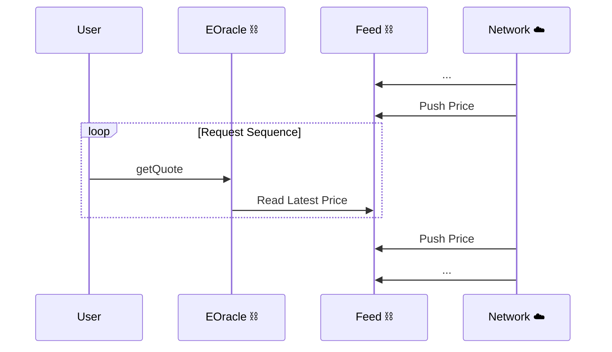
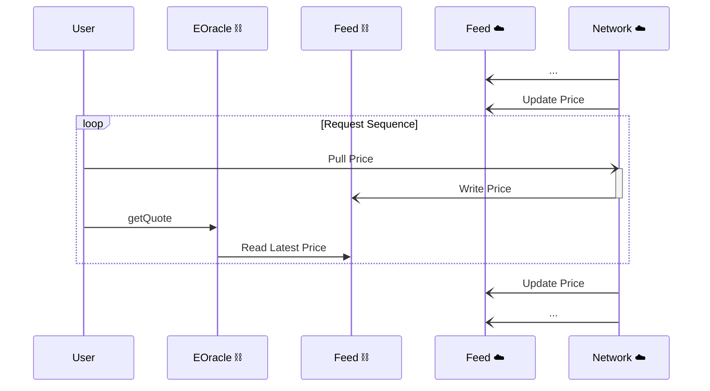
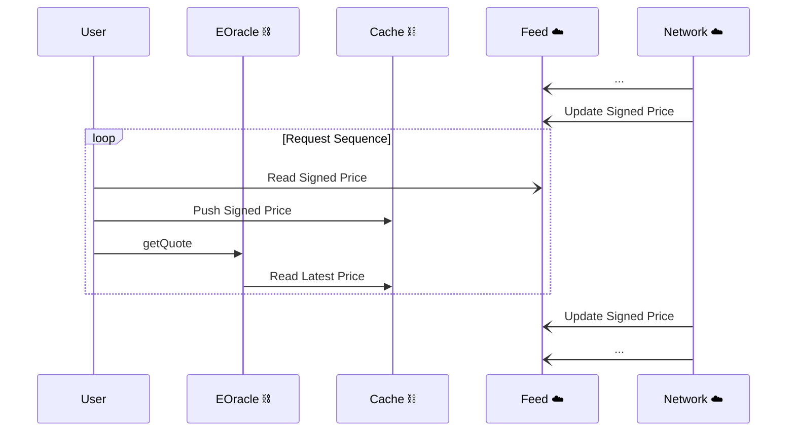
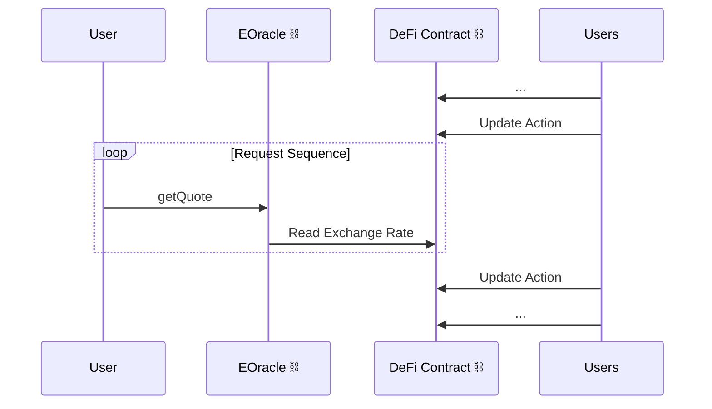
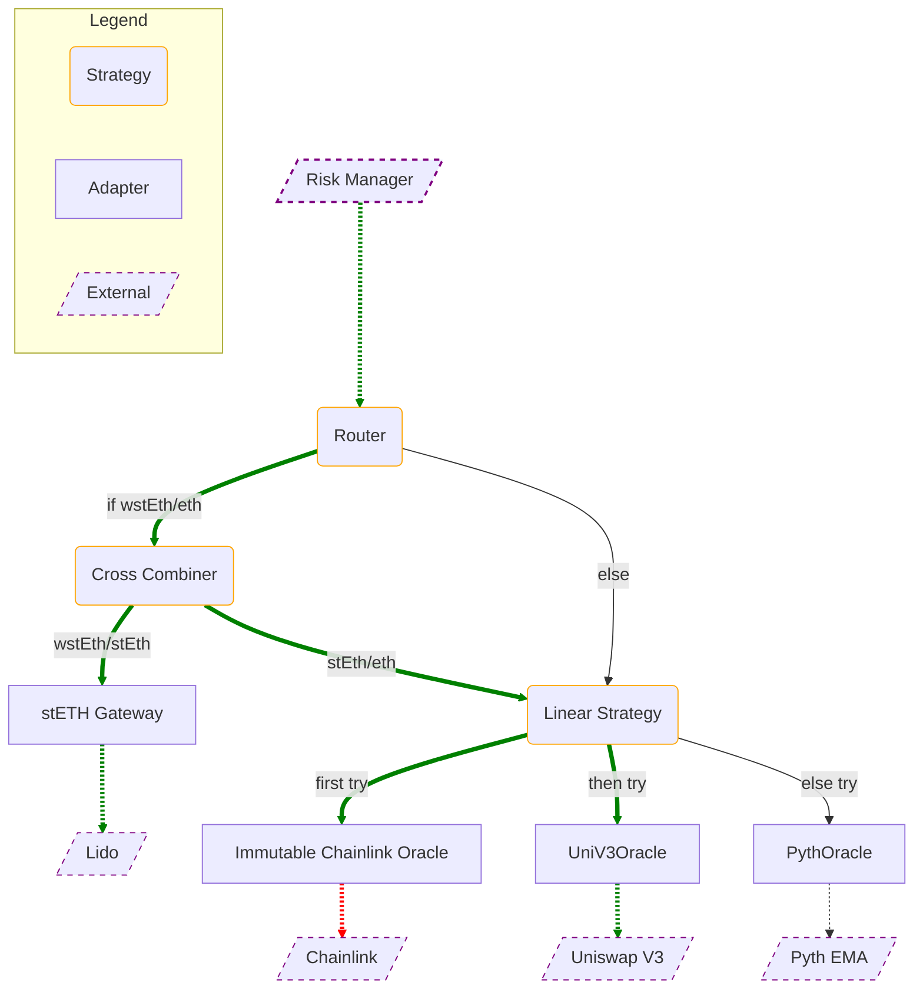

# Euler Oracles
<!-- TOC FOLLOWS -->
<!-- START OF TOC -->
<!-- DO NOT EDIT! Auto-generated by md-toc: https://github.com/hoytech/md-toc -->

* [Introduction](#introduction)
* [Interface](#interface)
* [EOracle Specification](#eoracle-specification)
    * [Definitions](#definitions)
    * [Methods](#methods)
        * [`description`](#description)
        * [`Description` schema](#description-schema)
        * [`getQuote` and `getQuotes`](#getquote-and-getquotes)
        * [`getQuote`](#getquote)
        * [`getQuotes`](#getquotes)
    * [Denominations](#denominations)
* [Data Structures](#data-structures)
    * [Immutable Address Array](#immutable-address-array)
    * [Packed Uint32 Array](#packed-uint32-array)
* [Adapters](#adapters)
    * [Size-aware Pricing](#size-aware-pricing)
        * [Reducing Scale Error](#reducing-scale-error)
    * [Request Models](#request-models)
        * [Push-based Systems](#push-based-systems)
        * [Pull-based Systems](#pull-based-systems)
        * [Signature-based Systems](#signature-based-systems)
        * [Dummy Systems](#dummy-systems)
    * [Supported Adapters](#supported-adapters)
        * [Chainlink](#chainlink)
        * [Chronicle](#chronicle)
        * [Compound V2](#compound-v2)
        * [Constant](#constant)
        * [Curve](#curve)
        * [Lido](#lido)
        * [Pyth](#pyth)
        * [RocketPool](#rocketpool)
        * [Tellor](#tellor)
        * [Uniswap V3](#uniswap-v3)
        * [Yearn V2](#yearn-v2)
* [Strategies](#strategies)
    * [Aggregators](#aggregators)
        * [Supported Aggregator Algorithms](#supported-aggregator-algorithms)
        * [Custom Aggregator Algorithms](#custom-aggregator-algorithms)
    * [Linear](#linear)
        * [Supported Linear Algorithms](#supported-linear-algorithms)
    * [Routers](#routers)
        * [Supported Router Algorithms](#supported-router-algorithms)
* [Composing EOracles](#composing-eoracles)
    * [Example Configuration](#example-configuration)

<!-- END OF TOC -->

## Introduction
**Euler Oracles** is a smart contract framework for deploying and managing custom price oracle configurations. Out of the box it provides integrations with 10+ leading blockchain oracles. Using the built-in primitives for routing, quote aggregation, and redundancy, teams can define a custom pricing strategy that suits their product's needs. Euler Oracles is built to solve the unique challenges posed by immutable lending markets yet allows for external governance to be retained and eventually revoked.

## Interface
Euler Oracles conform to the shared `IEOracle` interface.
```solidity
function description() external view returns (OracleDescription.Description memory description);
function getQuote(uint256 inAmount, address base, address quote) external view returns (uint256 outAmount);
function getQuotes(uint256 inAmount, address base, address quote) external view returns (uint256 bidOutAmount, uint256 askOutAmount);
```

## EOracle Specification
The key words "MUST", "MUST NOT", "REQUIRED", "SHALL", "SHALL NOT", "SHOULD", "SHOULD NOT", "RECOMMENDED",  "MAY", and "OPTIONAL" in this document are to be interpreted as described in [RFC 2119](https://datatracker.ietf.org/doc/html/rfc2119).
### Definitions
- **Asset:** An ERC20 token (denoted by its contract address), a currency (denoted by its ISO 4217 numeric code) or the native coin (denoted by `0xEeee...EEeE`).
- **Base:** The asset which is being priced.
- **Quote:** The asset which is used as the unit of account for the base.
- **EOracle:** Smart contracts that implement the `IEOracle` interface. EOracles can be composed together as part of the Euler Oracles framework. They either interface with external pricing providers or serve as utility layers.
- **Adapter:** An EOracle that directly connects to external contracts or systems that provide pricing. An adapter validates the data and casts it to the common `IEOracle` interface. An adapter may connect to canonical oracle systems like Chainlink, query DeFi contracts, or apply a hard-coded exchange rate.
- **Strategy:** An EOracle that serves as an intermediary logic layer. Strategies forward calls to several EOracles and combine the results into a single price.
- **Configuration tree:** A tree data structure composed of EOracles nodes that defines a self-contained oracle configuration.

### Methods
Oracles MUST implement `description`, `getQuote` and `getQuotes` as defined by the `IEOracle` interface. The methods MUST behave as specified in this section.

#### `description`
```solidity
function description() external view returns (Description memory);
```
- MUST NOT revert. 
- MUST faithfully represent the properties and configuration of the EOracle. 
- MUST reflect changes to the EOracle's properties as a result of governance or other mechanisms.

#### `Description` schema
```solidity
enum Variant {ADAPTER, STRATEGY}
enum Authority {GOVERNED, FINALIZED}
enum Upgradeability {UPGRADEABLE, IMMUTABLE}
enum Algorithm {SPOT, MEDIAN, ... , OTHER}
enum PaymentModel {FREE, SUBSCRIPTION, PER_REQUEST, OTHER}
enum RequestModel {PUSH, PULL, SIGNATURE, INTERNAL, OTHER}

struct Configuration {
    uint256 maxStaleness;
    address governor;
    bool supportsBidAskSpread;
}

struct Description {
    Algorithm algorithm;
    Authority authority;
    PaymentModel paymentModel;
    RequestModel requestModel;
    Variant variant;
    Configuration configuration;
    string name;
}
```
> Some definitions are redacted for brevity. See [src/lib/OracleDescription.sol](src/lib/OracleDescription.sol) for all definitions.
- `variant` MUST NOT change throughout the lifecycle of the EOracle.
- `authority` MUST reflect the current governance state of the EOracle as defined in the [Euler Vaults whitepaper.](https://github.com/euler-xyz/euler-vaults-docs/blob/master/whitepaper.md#governed-vs-finalised)
- `upgradeability` MUST reflect the deployment configuration in the EOracleFactory as defined in the [Euler Vaults whitepaper.](https://github.com/euler-xyz/euler-vaults-docs/blob/master/whitepaper.md#upgradeable-vs-immutable)
- `algorithm` MUST be the pricing algorithm implemented by the connected external oracle if the EOracle is an adapter.
- `algorithm` MUST be the aggregation algorithm internally implemented by the strategy if the EOracle is a strategy.
- `paymentModel` MUST reflect either the external oracle's payment model if the EOracle is an adapter.
- `paymentModel` MUST reflect the strategy's payment model if the EOracle is a strategy.
- `requestModel` MUST be 
    - `PUSH` if price updates are periodically updated on-chain without caller intent.
    - `PULL` if the caller has to make a transaction to request an up-to-date price to be pushed on-chain at a later block.
    - `SIGNATURE` if the price is ingested as part of data that is signed off-chain by a trusted party and verified at the point of execution.
    - `INTERNAL` if the EOracle is a strategy or an adapter whose pricing logic is fully internalized.
- `Configuration.maxStaleness` MUST be the maximum age in seconds of the price accepted by the EOracle. A value of 0 means that the price is updated every block.
- `Configuration.governor` MUST be `address(0)` if `authority` is `FINALIZED` or else the governor address as defined in the [Euler Vaults whitepaper.](https://github.com/euler-xyz/euler-vaults-docs/blob/master/whitepaper.md#governed-vs-finalised)
- `Configuration.supportsBidAskSpread` MUST be `true` if the EOracle natively supports quotes with bid-ask spreads. If this is `false`, then `getQuotes(in,b,q)` MUST return `(getQuote(in,b,q), getQuote(in,b,q))`.
- An EOracle MAY use the enum member `OTHER` whenever none of the other members accurately describe its properties.
- `name` MUST NOT change throughout the lifecycle of the EOracle.
- `name` SHOULD be a short string that describes the EOracle. EOracles are free to choose the format.
- `name` is RECOMMENDED to include the common name of the external system that is queried by adapters (e.g. "Chainlink").

#### `getQuote` and `getQuotes`
- MUST NOT return 0. If `outAmount` is calculated to be 0, then EOracle MUST revert with `PriceOracle_InvalidAnswer`.
- MUST support values for `inAmount` in the range `[1, 2^128-1]`. Values above `2^128-1` SHOULD be supported whenever possible.
- MUST revert with the custom error `EOracle_NotSupported` if the EOracle does not support the given base/quote pair either due to a limitation in the external system or due to missing configuration inside the EOracle. Note that the set of supported base/quote pairs could change throughout the lifecycle of the EOracle.
- MUST revert with the custom error `PriceOracle_TooStale` if the external system reports a price that is too old to be trusted.
- If the external call reverts or reports an invalid answer then EOracle MAY revert with the custom error `PriceOracle_NoAnswer` or alternatively bubble up the vendor-specific error.
- SHOULD revert with the custom error `EOracle_ArithmeticError` whenever a mathematical expression internal to the EOracle would overflow, underflow, or is undefined. EOracles SHOULD anticipate overflows wherever possible instead of relying on the run-time exceptions generated by Solidity.

#### `getQuote`
- MUST return the amount of `quote` that is price-equivalent to `inAmount` of `base` without accounting for spread due to slippage, fees or other on-chain conditions.

#### `getQuotes`
- MUST return the bid amount and ask amount of `quote` that is price-equivalent to `inAmount` of `base` by accounting for spread due to slippage, fees or other on-chain conditions.
- MAY return a zero-spread price if the external system does not support spread quotes i.e. return `(getQuote(in,b,q), getQuote(in,b,q))`

### Denominations
Source: [src/lib/Denominations.sol](src/lib/Denominations.sol)

Every asset in Euler Oracles is represented by a 160-bit `address`. To avoid ambiguity, EOracles:
- MUST denote an ERC20 token by its contract address on the host blockchain.
- MUST denote the native coin on the host blockchain by `0xEeeeeEeeeEeEeeEeEeEeeEEEeeeeEeeeeeeeEEeE` IFF the native coin does not implement ERC20.
- MUST denote the native coin on the host blockchain by its contract address IFF the native coin implements ERC20.
- MUST denote a national currency or precious metal by its numeric code as defined by ISO 4217, type-cast to `address`.
- MUST carefully adapt the nomenculature of external systems to the one defined by Euler Oracles.
- SHOULD avoid supporting coins or tokens on external blockchains and instead denominate in their wrapped or bridged versions on the host blockchain.
- MAY treat the native coin and the canonical wrapped asset as interchangeable assets after verifying that the wrapper contract is not mutable, governeable or upgradeable, and supports a 1:1 peg with the native coin, similar to WETH9.
- MAY use the ISO 4217 "No currency" code (999) to denote unknown or non-ISO 4217 currencies. Operations involving such assets MUST revert.
- MAY implement an extension to this standard by providing an alternative unambiguous, domain-separated, and observable standard of denomination.

## Data Structures
`ImmutableAddressArray` and `PackedUint32Array` are custom data structures useful for creating gas-efficient strategy EOracles. 

### Immutable Address Array
Source: [src/lib/ImmutableAddressArray.sol](src/lib/ImmutableAddressArray.sol)

An abstract contract that implements a fixed-size read-only array of up to 8 addresses.

The array is stored inside the code of the contract, thus making element retrieval signifcantly cheaper (using `CODECOPY` instead of `SLOAD`). Compared to a storage array, the immutable address array will inflate the gas cost at deployment but will noticeably reduce usage cost. 

The array is constructed by passing an in-memory address array which then intializes the 8 private immutable adresseses. At construction the cardinality (size) of the array is recorded and later used to perform bounds checking.

It internally exposes `get(index) -> element` and `find(element) -> index` methods. 

The immutable address array is practically useful for immutable EOracle strategies. See [src/strategy/linear/LinearStrategy.sol](src/strategy/linear/LinearStrategy.sol) for an example of how it can be used.

### Packed Uint32 Array
Source: [src/lib/PackedUint32Array.sol](src/lib/PackedUint32Array.sol)

A [user defined value type](https://soliditylang.org/blog/2021/09/27/user-defined-value-types/) that packs an ordered array of 8 `uint32` values inside a single 256-bit integer. 

By packing them together, all 8 values can be retrieved from storage with a single `SLOAD`. The internal methods of `PackedUint32Array` implement encoding and decoding that is cheaper than Solidity's native abi decoding. 

The type supports the functions `get`, `set`, `clear`, `mask`, `sum`, `eq`, `neq` which are tailored for its use cases inside EOracle strategies.

`PackedUint32Array` has synergy with `ImmutableAddressArray` as both define an array of size 8.

See [src/strategy/linear/ConstantBackoffLinearStrategy.sol](src/strategy/linear/ConstantBackoffLinearStrategy.sol) where it is used for storing cooldown timestamps.

See the [weighed mean function](src/strategy/aggregator/AggregatorFunctions.sol) where it is used as a bitmask over the immutable address array.

## Adapters
An adapter is an EOracle that directly interfaces with an external oracle. Adapters translate between the language of `IEOracle` and the external system.
An adapter validates the data and processes it to conform to the `IEOracle` interface. An adapter may connect to canonical oracle systems like Chainlink or query external DeFi contracts for exchange rates 
(Uniswap V3, wstETH contract). An exception to the rule is the `ConstantOracle` which returns a hard-coded exchange rate but is still regarded as an adapter for consistency.
Adapters connect to external oracles and adapt their interfaces and answers to the `IEOracle` interface.

### Size-aware Pricing
The EOracle interface is *size-aware*. The caller supplies `inAmount` and expects the EOracle to return `outAmount`, the price-equivalent amount of the quote asset. 

On the other hand, external oracles usually provide unit prices. For example, the USDC/ETH feed on Chainlink will return the amount of ETH equivalent to 1 USDC. The EOracle must scale the unit price up or down to arrive at `outAmount`.

For a sufficiently large `inAmount` a linearly scaled price will overestimate the actual market value of the quote asset. This is because of AMM slippage, which strictly increases with trade size. This behavior is inherent in all constant-function market makers. [[Engel and Herlihy 2022]](https://arxiv.org/pdf/2110.09872.pdf). We call this divergence property *scale error*.

Scale error is a tail for a lending market. Consider a lending pair where the collateral asset has thin on-chain liquidity. When liquidating a large position. When this EOracle would indicate

#### Reducing Scale Error
Scale error should be accounted for in the RiskManager. The Risk Manager can discount `outAmount` by internally modelling the instantaneous slippage of the implied AMM implied by `getQuote`. It can also implement additional risk measures such as supply caps to counter the resulting tail-end inaccuracies.


<!-- 
$$\mathbf{s}(k,\lambda) =\frac{\lambda\ln(1+k)}{1+\lambda\ln(1+k)}$$

where $\lambda > 0$ is a measure of the liquidity of the asset and $k = \frac{inAmount}{unit}$. 

The properties of $\mathbf{s}(k)$ are that
$$\mathbf{s}(0,\lambda) = 0$$
$$\mathbf{s}(k,0) = 0$$
$$\lim_{k \to +\infty}\mathbf{s}(k,\lambda) = 1$$ 

Large values for $\lambda$ will make $\mathbf{s}$ converge faster to 1 so $\lambda$ should be inversely proportional to on-chain liquidity. Note that the overall liquidity of an asset should be measured across DEXes and all pairings should be taken into account.

| Size  | Empirical Slippage | Modelled Slippage |
| -- | -- | -- |
| 100000  | 0.0048 | x  |
| 500000  | 0.0228 | x  |
| 1000000  | 0.064 | x  |
| 5000000  | 62.22 | x  |
| 10000000  | 80.47 | x  | -->
### Request Models
#### Push-based Systems
Push-based oracle systems have an off-chain *consensus network* of materially invested third parties. The network agrees on the current price and pushes it periodically on-chain to a *feed contract.* The EOracle directly reads this price from the feed.

Since writing data to the blockchain is expensive, push oracles implement trigger conditions which decide when to push a price to the feed. A common trigger strategy is by defining *deviation threshold* $\delta_{min} \in(0,1)$ for the feed. The recorded price $p$ is updated only if the instantaneous price $p*$ sufficiently deviates from $p$, more precisely when $|1-\frac{p*}{p}| > \delta_{min}$.

The true price $\mathbf{p}$ can be modelled (ignoring drift) as a one-dimensional Wiener process $W_t$, therefore $\mathbf{p} \sim N(p,\ \sigma^2)$, truncated to $\mathbf{p} \in (p-\delta_{min}p,\ p+\delta_{min}p)$.

In the implementation of `getQuotes` an EOracle may choose to ignore the deviation and return $(p,\ p)$. It may return the full range $(p-\delta_{min}p,\ p+\delta_{min}p)$, or a tighter range confidence interval over the latter trunctated normal distribution.

**Sequence Diagram**


**Request Sequence**
1. User calls `getQuote` on EOracle.
1. EOracle reads the latest pushed price from the feed.

#### Pull-based Systems

**Sequence Diagram**


**Request Sequence**
1. User requests off-chain a price update from the network.
1. Network fulfills the request by writing the price on-chain.
1. User calls `getQuote` on EOracle.
1. EOracle reads the latest pushed price from the feed.

#### Signature-based Systems

**Sequence Diagram**


**Request Sequence**
1. User requests the latest signed price from the network.
1. Network fulfills the request by sending the signed price to the user.
1. User pushes the message on-chain to a custom cache contract. The cache contract validates the message and stores the price.
1. User calls `getQuote` on EOracle.
1. EOracle reads the latest pushed price from the cache.

#### Dummy Systems

**Sequence Diagram**


**Request Sequence**
1. User calls `getQuote` on EOracle.
1. EOracle reads or infers an exchange rate from the current state of a DeFi contract.

### Supported Adapters

#### Chainlink
Chainlink is a push-based oracle system. A Chainlink feed is a smart contract that stores the current and historical unit price of a base/quote pair. The quote (denomination) is ETH, USD or BTC. A set of privileged third parties (node operators) can submit on-chain pricing. A quorum is required to update prices. Prices are pushed on-chain when a deviation threshold is exceeded or the price hasn't been updated for a period of time (this parameter is called the *heartbeat*). The trigger parameters are not observable on-chain.

**Trust model**

Chainlink data feeds sit behind an upgradeable proxy. The upgrade admin is a 4/9 multisig contract. None of the owners of the multisig are publically identified or KYC'd. Two addresses have never transacted.

**Risks**

Chainlink feeds may be [deprecated.](https://docs.chain.link/data-feeds/deprecating-feeds?network=deprecated&page=1)

#### Chronicle
Chronicle is a push-based oracle system. Chronicle feeds are smart contracts that store the current unit price of a base/quote pair. A set of privileged third parties (node operators) can submit on-chain pricing. A quorum is required to update prices. Prices are pushed on-chain when a deviation threshold is exceeded or the price hasn't been updated for a period of time (this parameter is called the *heartbeat*). The trigger parameters are not observable on-chain.

#### Compound V2
Source: [CTokenV2Oracle.sol](src/adapter/compound-v2/CTokenV2Oracle.sol)

`CTokenV2Oracle` retrieves the exchange rate of a cToken relative to its underlying asset. It calls `exchangeRateStored` and `accrualBlockNumber` on the cToken contract to get the latest exchange rate and the block in which it was updated. Staleness in seconds can be derived by `12 * 1.02 * (block.number - accrualBlockNumber)`, assuming a 2% [missed slot rate.](https://beaconcha.in/charts/slotviz)

Alternatively, the user can call `accrueInterest` on the cToken contract to force an update to `exchangeRateStored`.

#### Constant
Source: [ConstantOracle.sol](src/adapter/constant/ConstantOracle.sol)

`ConstantOracle` is a dummy oracle that stores a preconfigured exchange rate.

#### Curve
Source: [CurveLPOracle.sol](src/adapter/curve/CurveLPOracle.sol)

Queries a Curve pool contract to price an LP token in terms of its underlying tokens.

#### Lido
Source: [WstEthOracle.sol](src/adapter/lido/WstEthOracle.sol)

Queries the wstEth contract to convert between stEth and wstEth.

#### Pyth
Source: [ImmutablePythOracle.sol](src/adapter/pyth/ImmutablePythOracle.sol), [ImmutablePythEMAOracle.sol](src/adapter/pyth/ImmutablePythEMAOracle.sol)

Queries a Pyth oracle. Supports bid-ask spread.

#### RocketPool
Source: [RethOracle.sol](src/adapter/rocketpool/RethOracle.sol)

Queries the Reth contract to convert between Reth and Eth.

#### Tellor
Source: [TellorSpotOracle.sol](src/adapter/tellor/TellorSpotOracle.sol)

Queries a Tellor oracle.

#### Uniswap V3
Source: [ImmutableUniswapV3Oracle.sol](src/adapter/uniswap/ImmutableUniswapV3Oracle.sol)

Calculates the TWAP price maintained by a Uniswap V3 pool.

#### Yearn V2
Source: [YearnV2VaultOracle.sol](src/adapter/yearn-v2/YearnV2VaultOracle.sol)

Queries a Yearn V2 vault contract to price a yvToken in terms of its underlying.

## Strategies
Euler Oracles support a library of common strategies.

### Aggregators
Aggregator strategies simultaneously query up to 8 underlying oracles and apply a statistical algorithm on the set of results. They also have a notion of `quorum`. Underlying oracles are queried with a `try-catch` mechanism and 

#### Supported Aggregator Algorithms
- `Min` returns the smallest quote of its underlying oracles.
- `Max` returns the largest quote of its underlying oracles.
- `Mean` returns the arithmentic mean quote of its underlying oracles.
- `Median` returns the statistical median quote of its underlying oracles. Note that if the cardinality of the set of answers received is even, then the median is the arithmetic mean of its middle 2 elements.
- `Weighted` returns the weighted arithmetic mean of the set of quotes. Weights are assigned at construction and immutable. If an underlying oracle does not produce a quote then its weight is dropped from the calculation.

#### Custom Aggregator Algorithms
To implement a custom algorithm extend the base `Aggregator` contract and override the virtual `_aggregateQuotes` function.
```solidity
function _aggregateQuotes(
    uint256[] memory quotes, 
    PackedUint32Array mask
) internal view returns (uint256) {
    /// custom aggregation logic
}
```

`quotes` is a compressed array of all valid quotes. `mask` is a bitmask-like data structure that indicates which of the underlying oracles returned successfully.

### Linear
Linear strategies maintain an ordered set of underlying oracles. Underlying oracles are queried in the given order until a valid quote is obtained.

#### Supported Linear Algorithms
- `LinearStrategy` implements the base logic outlined above.
- `ConstantBackoffLinearStrategy` extends the base algorithm and applies a constant-time backoff to unsuccessful queries. When an underlying oracle fails, it will be skipped for the next time period (e.g. 1 hour).

### Routers
Router strategies implement traffic control algorithms. A routers is often useful as the top-level entry point for the configuration tree.

#### Supported Router Algorithms
- `SimpleRouter` supports an on-chain mapping of `(base,quote) -> oracle`.
- `FallbackRouter` extends `SimpleRouter` with a fallback oracle that is queried for all unresolved paths.

## Composing EOracles
A *configuration tree* is a tree of EOracles that defines a self-contained oracle configuration. Consumers only need to store the root node of the configuration tree. A call will resolve via a specific subtree of the configuration tree. Leaves are adapters, the contact point with external systems. They propagate quotes to the internal strategy nodes, which collapse multiple quotes into one and return it up the ancestry chain. The tree branches out when it contains a strategy that connects to multiple child EOracles. The resolution tree only defines the topology of the oracle configuration. The path taken by a specific call will depend on the logic inside strategies.

The simplest configuration is a single adapter, e.g. an EOracle that queries a Chainlink feed. A more complex configuration is illustrated below:

### Example Configuration


**Explanation:**

In the Risk Manager, the oracle address is configured as `Router`. This is also the root node of the configuration tree.
The Risk Manager calls `Router` to price `wstEth/eth`. The call is routed to the `Cross Combiner` which multiplies the `wstEth/stEth` exchange rate from the Lido contract and the `stEth/eth` price returned by the `Linear Strategy`. The `Linear Strategy` first tries to fetch `wstEth/eth` from Chainlink but fails. It then falls back to Uniswap V3, which sucessfully returns a price. At this point the resolution is done and the resolved `wstEth/eth` price is returned.