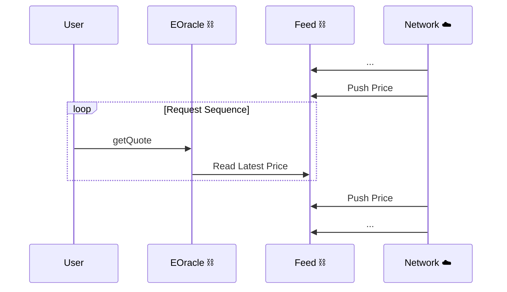
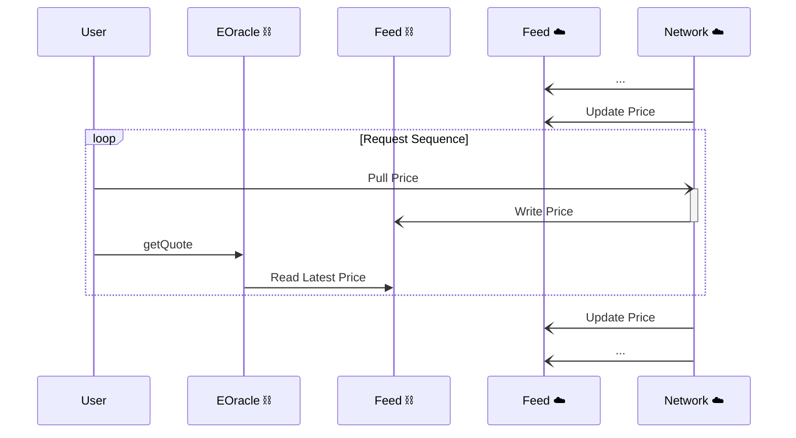
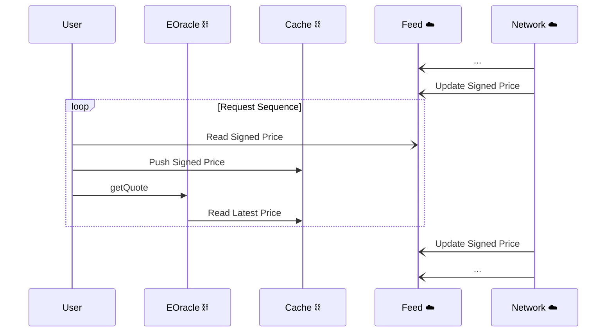
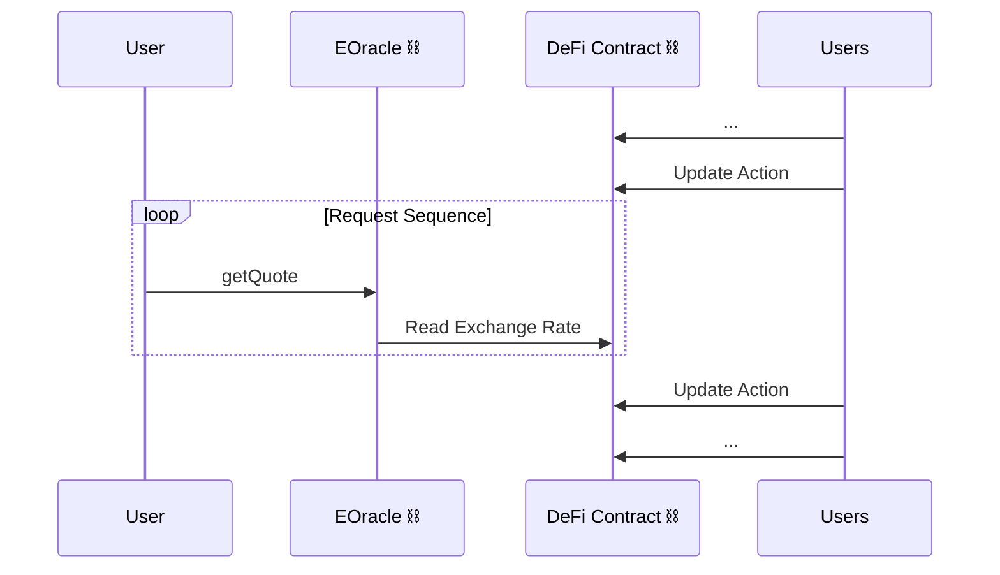
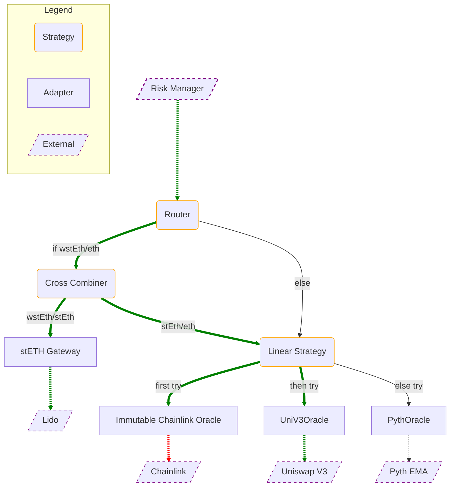

# Euler Oracles
<!-- TOC FOLLOWS -->
<!-- START OF TOC -->
<!-- DO NOT EDIT! Auto-generated by md-toc: https://github.com/hoytech/md-toc -->
*Draft: v1.1*
* [Introduction](#introduction)
* [Interface](#interface)
* [Adapters](#adapters)
    * [Price Divergence](#price-divergence)
        * [Modelling Slippage](#modelling-slippage)
    * [Request Models](#request-models)
        * [Push-based Systems](#push-based-systems)
        * [Pull-based Systems](#pull-based-systems)
        * [Signature-based Systems](#signature-based-systems)
        * [Dummy Systems](#dummy-systems)
    * [Supported Adapters](#supported-adapters)
        * [Chainlink](#chainlink)
        * [Chronicle](#chronicle)
        * [Compound V2](#compound-v2)
        * [Constant](#constant)
        * [Curve](#curve)
        * [Lido](#lido)
        * [Pyth](#pyth)
        * [RocketPool](#rocketpool)
        * [Tellor](#tellor)
        * [Uniswap V3](#uniswap-v3)
        * [Yearn V2](#yearn-v2)
* [Strategies](#strategies)
    * [Aggregators](#aggregators)
        * [Supported Aggregator Algorithms](#supported-aggregator-algorithms)
        * [Custom Aggregator Algorithms](#custom-aggregator-algorithms)
    * [Linear](#linear)
        * [Supported Linear Algorithms](#supported-linear-algorithms)
    * [Routers](#routers)
        * [Supported Router Algorithms](#supported-router-algorithms)
* [Data Structures](#data-structures)
    * [Immutable Address Array](#immutable-address-array)
    * [Packed Uint32 Array](#packed-uint32-array)
* [EOracle Specification](#eoracle-specification)
    * [Definitions](#definitions)
    * [Methods](#methods)
        * [`description`](#description)
        * [`Description` schema](#description-schema)
        * [`getQuote` and `getQuotes`](#getquote-and-getquotes)
        * [`getQuote`](#getquote)
        * [`getQuotes`](#getquotes)
    * [Denominations](#denominations)
* [Composing EOracles](#composing-eoracles)
    * [Example Configuration](#example-configuration)

<!-- END OF TOC -->

## Introduction
**Euler Oracles** is a smart contract framework for deploying and managing custom price oracle configurations. Out of the box it provides integrations with 10+ leading blockchain oracles. Using the built-in primitives for routing, quote aggregation, and redundancy, teams can define a custom pricing strategy that suits their product's needs. Euler Oracles is built to solve the unique challenges posed by immutable lending markets yet allows for external governance to be retained and eventually revoked.

## Interface
Euler Oracles conform to the shared `IEOracle` interface.
```solidity
function description() external view returns (OracleDescription.Description memory description);
function getQuote(uint256 inAmount, address base, address quote) external view returns (uint256 outAmount);
function getQuotes(uint256 inAmount, address base, address quote) external view returns (uint256 bidOutAmount, uint256 askOutAmount);
```

## Configuration
- Common configuration flow (`_initializeOracle`, `_getConfig`, `_setConfig`)
- Unified standard for configurable, upgradeable / immutable
- Convention to populate inverse path in mappings upon configuration OR NOT ?

## Adapters
An adapter is an EOracle that directly interfaces with an external oracle. It validates the received data and casts it to the shared interface. An adapter may connect to canonical oracle systems like Chainlink or query external DeFi contracts for exchange rates 
(Uniswap V3, wstETH contract). An exception to the rule is the `ConstantOracle` which returns a hard-coded exchange rate but is still regarded as an adapter for consistency.

### Price Divergence
The EOracle interface is *size-aware*. The caller supplies `inAmount` and expects the EOracle to return `outAmount`, the price-equivalent amount of the quote asset. 

On the other hand, external oracles usually provide unit prices. For example, the USDC/ETH feed on Chainlink will return the amount of ETH equivalent to 1 USDC. The EOracle must scale the unit price up or down to arrive at `outAmount`.

For a sufficiently large `inAmount` a linearly scaled price will overestimate the actual market value of the quote asset. This is because of AMM slippage, which strictly increases with trade size. This behavior is inherent in all constant-function market makers. [[Engel and Herlihy 2022]](https://arxiv.org/pdf/2110.09872.pdf). We call this property *price divergence*.

Unhandled price divergence presents a tail risk for lending markets. During liquidation, selling collateral into AMMs with thin liquidity will exacerbate the divergence, which may eventually trigger a destructive liquidation spiral.

Price divergence should be accounted for in the risk configuration of the lending market. The received `outAmount` may need to be discounted according to a model for instantaneous slippage of the AMM trade that is implied by `getQuote`. Additional risk policies such as supply caps can be a hard limit on the effects of price divergence.

#### Modelling Slippage
Todo - this is actually not a very good model

$$\mathbf{s}(k,\lambda) =\frac{\lambda\ln(1+k)}{1+\lambda\ln(1+k)}$$

where $\lambda > 0$ is a measure of the liquidity of the asset and $k = \frac{inAmount}{unit}$. 

The properties of $\mathbf{s}(k)$ are that
$$\mathbf{s}(0,\lambda) = 0$$
$$\mathbf{s}(k,0) = 0$$
$$\lim_{k \to +\infty}\mathbf{s}(k,\lambda) = 1$$ 

Large values for $\lambda$ will make $\mathbf{s}$ converge faster to 1 so $\lambda$ should be inversely proportional to on-chain liquidity. Note that the overall liquidity of an asset should be measured across DEXes and all pairings should be taken into account.

### Request Models
#### Push-based Systems
Push-based oracle systems have an off-chain *consensus network* of materially invested third parties. The network agrees on the current price and pushes it periodically on-chain to a *feed contract.* The EOracle directly reads this price from the feed.

Since writing data to the blockchain is expensive, push oracles implement trigger conditions which decide when to push a price to the feed. A common trigger strategy is by defining *deviation threshold* $\delta_{min} \in(0,1)$ for the feed. The recorded price $p$ is updated only if the instantaneous price $p*$ sufficiently deviates from $p$, more precisely when $|1-\frac{p*}{p}| > \delta_{min}$.

The true price $\mathbf{p}$ can be modelled (ignoring drift) as a one-dimensional Wiener process $W_t$, therefore $\mathbf{p} \sim N(p,\ \sigma^2)$, truncated to $\mathbf{p} \in (p-\delta_{min}p,\ p+\delta_{min}p)$.

In the implementation of `getQuotes` an EOracle may choose to ignore the deviation and return $(p,\ p)$. It may return the full range $(p-\delta_{min}p,\ p+\delta_{min}p)$, or a tighter range confidence interval over the latter trunctated normal distribution.

**Sequence Diagram**


**Request Sequence**
1. User calls `getQuote` on EOracle.
1. EOracle reads the latest pushed price from the feed.

#### Pull-based Systems

**Sequence Diagram**


**Request Sequence**
1. User requests off-chain a price update from the network.
1. Network fulfills the request by writing the price on-chain.
1. User calls `getQuote` on EOracle.
1. EOracle reads the latest pushed price from the feed.

#### Signature-based Systems

**Sequence Diagram**


**Request Sequence**
1. User requests the latest signed price from the network.
1. Network fulfills the request by sending the signed price to the user.
1. User pushes the message on-chain to a custom cache contract. The cache contract validates the message and stores the price.
1. User calls `getQuote` on EOracle.
1. EOracle reads the latest pushed price from the cache.

#### Dummy Systems

**Sequence Diagram**


**Request Sequence**
1. User calls `getQuote` on EOracle.
1. EOracle reads or infers an exchange rate from the current state of a DeFi contract.

## Composing EOracles
A *configuration tree* is a tree of EOracles that defines a self-contained oracle configuration. Consumers only need to store the root node of the configuration tree. A call will resolve via a specific subtree of the configuration tree. Leaves are adapters, the contact point with external systems. They propagate quotes to the internal strategy nodes, which collapse multiple quotes into one and return it up the ancestry chain. The tree branches out when it contains a strategy that connects to multiple child EOracles. The resolution tree only defines the topology of the oracle configuration. The path taken by a specific call will depend on the logic inside strategies.

The simplest configuration is a single adapter, e.g. an EOracle that queries a Chainlink feed. A more complex configuration is illustrated below:

### Example Configuration


**Explanation:**

In the Risk Manager, the oracle address is configured as `Router`. This is also the root node of the configuration tree.
The Risk Manager calls `Router` to price `wstEth/eth`. The call is routed to the `Cross Combiner` which multiplies the `wstEth/stEth` exchange rate from the Lido contract and the `stEth/eth` price returned by the `Linear Strategy`. The `Linear Strategy` first tries to fetch `wstEth/eth` from Chainlink but fails. It then falls back to Uniswap V3, which sucessfully returns a price. At this point the resolution is done and the resolved `wstEth/eth` price is returned.